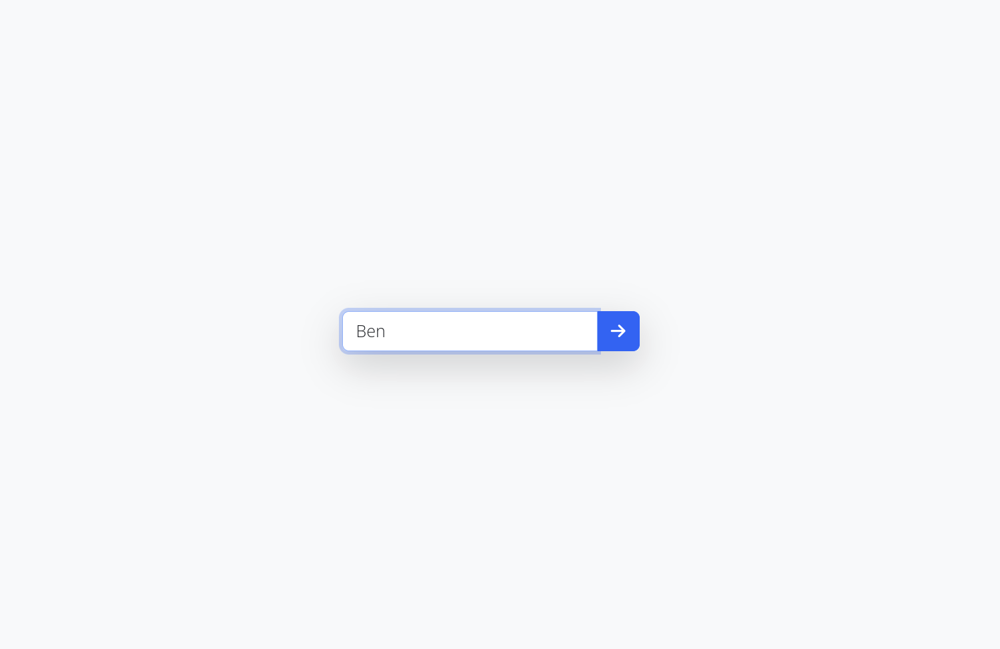
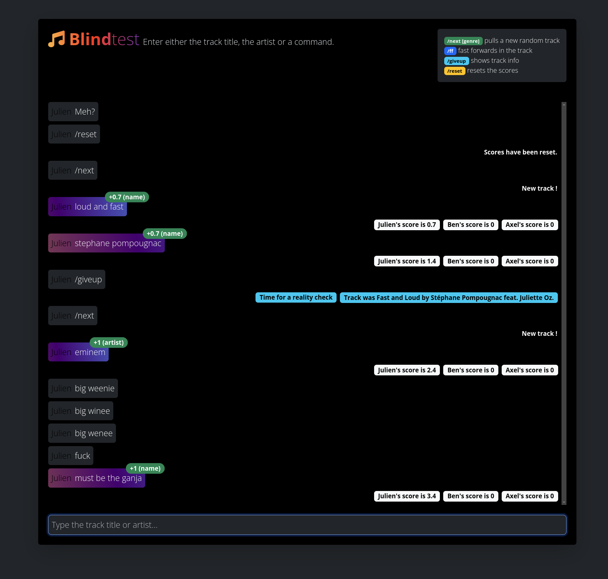

# Screenshots

# Features

* Real-time multiplayer music guessing game
* Websocket-based communication for instant updates
* Flexible scoring system with partial matching
* In-game commands for track management and hints
* Genre and year-based track selection

# Requirements 

* PHP 8.2+
* Composer
* Node.js and npm
* SQLite

# Installation

Sequentially 
* `composer install` _installs PHP dependencies_
* `npm install` _installs NodeJS dependencies_
* Place your music in `storage/app/music` (MP3 files)
* `touch database/database.sqlite` _creates an empty database_
* `mv .env.example .env` _use the default env file_
* `php artisan migrate:fresh` _rebuilds the database_
* `php artisan reverb:install` _regenerates reverb keys and config (Answer Yes)_ 
* `php artisan music:scan` _scans your music, extracts ID3 tags and inserts in the database_
* `php artisan key:generate` _generates a crypto key_

# Running

Run these commands in separate terminal windows: 

* `php artisan serve` _runs the local webserver_
* `php artisan reverb:start` _runs the websocket_
* `npm run dev` _runs the JS/CSS tools_

Access the application at [http://localhost:8000](http://localhost:8000)

# In-game commands 

* `/next [genre|year] [genre|year]` Select a new random track
* `/ff` Fast forward the current track
* `/clue` Reveal 20% of the track info (reduces potential points)
* `/giveup` Reveal track info and end the current round
* `/reset` Reset all user scores to zero

Note that the genre/year is not saved. 

Consider the following sequence : 
* call `/next 2000 house`
* The next track will be of genre containing House in decade 2000-2009
* call `/next`
* The next track will be totally random

# Scoring System

Matching is not case sensitive.

* Exact matches for name, remix, or artist: 1 point each (max 3 points per track)
* Partial word matches (for a little of `n` words):
    * Correct word, correct position: `1/n` point
    * Correct word, wrong position: `1/n/2` point

_A minimum score of 0.33 is required for an answer to be accepted._

# Security Notice

**This application has no built-in authentication.** It is intended for local network use only. To secure it for public deployment, consider implementing:
* HTTP Basic Authentication
* User registration and login system
